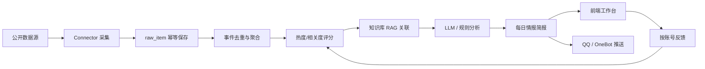
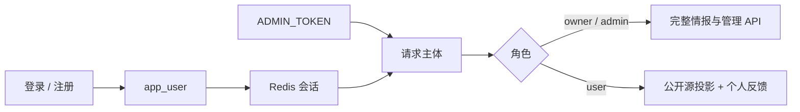

# 架构说明

## 主流程

情报主链路仍是一次可观测任务：公开源采集、证据校验、去重评分、知识库关联、模型分析、早报落库，再分发到工作台和 QQ。

账号不参与采集与分析写路径。`app_user` 只决定谁能读完整情报、谁只能看公开源投影，以及反馈按谁生效。

## 核心模块

- `backend/app/agent/runner.py`：一次情报任务的编排入口。
- `backend/app/connectors/`：公开数据源适配层。
- `backend/app/pipeline/`：去重、评分、RAG、分析和简报生成。
- `backend/app/services/`：模型供应商、知识库、推送、调度和健康检测。
- `backend/app/services/briefing_task_service.py`：早报生成异步任务、状态查询和线程执行。
- `backend/app/services/user_service.py`：账号持久化、密码生命周期和启动时导入管理员。
- `backend/app/services/session_service.py`：Redis 会话、登录锁定和跨实例限流。
- `backend/app/services/member_view_service.py`：普通用户情报投影，只保留公开源证据和规则摘要。
- `backend/app/services/feedback_service.py`：按账号隔离的有用、无关、收藏、屏蔽反馈。
- `backend/app/services/deployment_check_service.py`：上线交付就绪检查，聚合安全配置、真实数据证据链、采集源、模型/RAG、运维自动化和交付资产。
- `backend/app/core/security.py`：会话或服务令牌鉴权、角色路由门槛和基础限流中间件。
- `backend/app/core/secrets.py`：模型 Key 加密和脱敏。
- `frontend/src/App.vue`：今日情报工作台；按角色裁剪导航和管理入口。
- `frontend/src/views/LoginPage.vue` / `ProfilePage.vue` / `UsersPage.vue`：登录注册、个人资料和用户管理。

## 身份与权限

账号真相在 MySQL `app_user`。启动时若库中还没有管理员，才从 `ADMIN_USERNAME` / `ADMIN_PASSWORD_BCRYPT` 导入一次；之后昵称和密码以数据库为准，改环境变量不会覆盖已有账号。

1. 登录签发独立会话 token，写入 Redis，并绑定 `user_id` 与 `auth_version`。每次请求都回查账号是否仍存在、仍启用，且版本未变。
2. 停用账号、本人改密、管理员重置密码后递增 `auth_version`，旧会话立即失效。退出登录主动删除当前 Redis 会话。
3. `ADMIN_TOKEN` 只给服务间调用，登录接口不再返回它。该通道映射为 `owner` 服务主体，不经过 `app_user` 行。
4. 注册默认开启（`REGISTRATION_ENABLED`），新账号固定为 `user`。管理员账号受保护：用户管理不能停用、改角色或重置管理员密码。
5. 普通用户可访问的 API 由中间件白名单约束：读今日/历史早报、热点池、个人反馈，以及本人资料。采集、模型、知识库、调度、推送、系统日志和用户管理只对 `owner` / `admin` 开放。
6. 前端同步裁剪导航：普通用户只保留今日情报、热点池、简报归档、反馈记录和个人中心。

## 普通用户情报投影

`event` / `daily_briefing` 仍由管理员任务写入，是完整情报的系统记录。普通用户响应是只读投影，不是第二份存储：

1. 只保留官方公开源条目和 item 级原文链接。
2. 摘要用规则分析现场重算，不回传知识库引用、私有上下文生成的分析或运行错误。
3. 简报列表只给日期标题，不泄露管理员摘要。
4. 投影丢失时按生成器（`member_view_service`）修复，不回写 `event` / `daily_briefing`。

当前没有普通用户私人知识库，也没有角色晋升接口。

## 数据质量策略

1. 不使用样例、模拟或固定演示数据伪造真实采集结果。
2. 所有进入 `raw_item` / `event` / `daily_briefing` 的数据必须具备 item 级 `http(s)` 原文链接。
3. 采集源失败进入健康页和运行记录，不阻断其他源，也不伪装为成功。
4. raw item 对 7 天内重复数据做幂等复用，但旧行也必须重新校验原文证据。
5. 热点排序综合来源权重、榜单排名、原始热度、多源确认、新鲜度和 AI / 科技相关度。
6. 政策类源默认关闭，只作为需要时的环境参考，不进入主线高相关判断。
7. 反馈按 `(event_key, action, created_by)` 唯一；展示排序和屏蔽只作用于当前账号。管理员看板的屏蔽统计仍按管理员用户名汇总。

## 安全策略

1. `/api` 默认需要 `Authorization: Bearer <token>` 或 `X-Admin-Token`。登录、注册、鉴权选项和 `/api/system/status` 豁免。
2. 浏览器只保存后端签发的会话凭据；模型 API Key 使用 `APP_SECRET_KEY` 派生密钥加密入库，前端只展示脱敏 Key。
3. 写操作和高频读取使用 Redis 滑动窗口限流，多 worker / 多实例共享计数；Redis 异常时按配置决定拒绝请求或降级放行。
4. 登录失败按账号与客户端 IP 锁定；客户端 IP 只在配置了可信代理层数时才读取 `X-Forwarded-For`。
5. 实时采集源探测有缓存 TTL，避免连续打外部公开源。

## 上线交付检查

`GET /api/system/readiness` 会生成一份面向产品交付的检查报告：

1. 安全与访问控制：API 鉴权、管理员 token、密码、APP_SECRET_KEY、CORS、限流和登录锁定。
2. 真实数据与证据链：真实数据策略、raw item 原文链接、event 到 raw item 的追溯、最近任务数据覆盖和早报归档。
3. 采集源健康：启用源数量、健康/降级/不可用源和最近采集任务新鲜度。
4. 模型与知识库：模型 Provider、连通性测试、LLM 成功率和 RAG / Embedding 配置。
5. 运维与自动化：系统日志、定时任务、推送通道、Alembic revision 和一键脚本。
6. 交付资产：README、交付清单、架构文档、假数据入口清理和前后端入口。

前端“数据看板”消费该接口并展示“可部署验收 / 需要关注 / 存在阻塞”、优先处理项与分类状态。

## 仍需升级

- 长任务队列企业化：当前已支持后台线程异步任务 + 进度查询，生产可替换为 Celery / RQ / 云队列。
- 团队与进阶权限：现有实现覆盖账号、`user` / `admin` / `owner`、个人反馈和只读情报投影；不含团队空间、私人知识库或角色晋升。
- 可观测性：Prometheus / OpenTelemetry / 告警。
