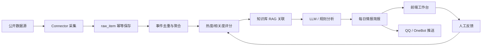

# 架构说明

## 主流程

## 核心模块

- `backend/app/agent/runner.py`：一次情报任务的编排入口。
- `backend/app/connectors/`：公开数据源适配层。
- `backend/app/pipeline/`：去重、评分、RAG、分析和简报生成。
- `backend/app/services/`：模型供应商、知识库、推送、调度和健康检测。
- `backend/app/services/briefing_task_service.py`：早报生成异步任务、状态查询和线程执行。
- `backend/app/services/feedback_service.py`：有用、无关、收藏、屏蔽反馈闭环。
- `backend/app/services/deployment_check_service.py`：上线交付就绪检查，聚合安全配置、真实数据证据链、采集源、模型/RAG、运维自动化和交付资产。
- `backend/app/core/security.py`：管理员令牌与基础限流中间件。
- `backend/app/core/secrets.py`：模型 Key 加密和脱敏。
- `frontend/src/App.vue`：今日情报工作台和管理诊断入口。

## 数据质量策略

1. 不使用样例、模拟或固定演示数据伪造真实采集结果。
2. 所有进入 `raw_item` / `event` / `daily_briefing` 的数据必须具备 item 级 `http(s)` 原文链接。
3. 采集源失败进入健康页和运行记录，不阻断其他源，也不伪装为成功。
4. raw item 对 7 天内重复数据做幂等复用，但旧行也必须重新校验原文证据。
5. 热点排序综合来源权重、榜单排名、原始热度、多源确认、新鲜度和 AI / 科技相关度。
6. 政策类源默认关闭，只作为需要时的环境参考，不进入主线高相关判断。
7. 人工反馈会影响展示排序；屏蔽项默认不进入首页和热点池。

## 安全策略

1. `/api` 默认需要 `Authorization: Bearer <ADMIN_TOKEN>` 或 `X-Admin-Token`。
2. 模型 API Key 使用 `APP_SECRET_KEY` 派生密钥加密入库。
3. 前端只展示脱敏 Key。
4. 写操作和高频读取使用 Redis 滑动窗口限流，多 worker / 多实例共享计数；Redis 异常时按配置决定拒绝请求或降级放行。
5. 实时采集源探测有缓存 TTL，避免连续打外部公开源。

## 上线交付检查

`GET /api/system/readiness` 会生成一份面向产品交付的检查报告：

1. 安全与访问控制：API 鉴权、管理员 token、密码、APP_SECRET_KEY、CORS、限流和登录锁定。
2. 真实数据与证据链：真实数据策略、raw item 原文链接、event 到 raw item 的追溯、最近任务数据覆盖和早报归档。
3. 采集源健康：启用源数量、健康/降级/不可用源和最近采集任务新鲜度。
4. 模型与知识库：模型 Provider、连通性测试、LLM 成功率和 RAG / Embedding 配置。
5. 运维与自动化：系统日志、定时任务、推送通道、Alembic revision 和一键脚本。
6. 交付资产：README、交付清单、架构文档、假数据入口清理和前后端入口。

前端“数据看板”消费该接口并展示“可部署验收 / 需要关注 / 存在阻塞”、优先处理项与分类状态。

## 仍需升级

- 长任务队列企业化：当前已支持后台线程异步任务 + 进度查询，生产可替换为 Celery / RQ / 云队列。
- 多用户：账号、团队、角色权限。
- 可观测性：Prometheus / OpenTelemetry / 告警。
- 多用户反馈：把当前管理员级反馈扩展为团队、角色和个人偏好。
